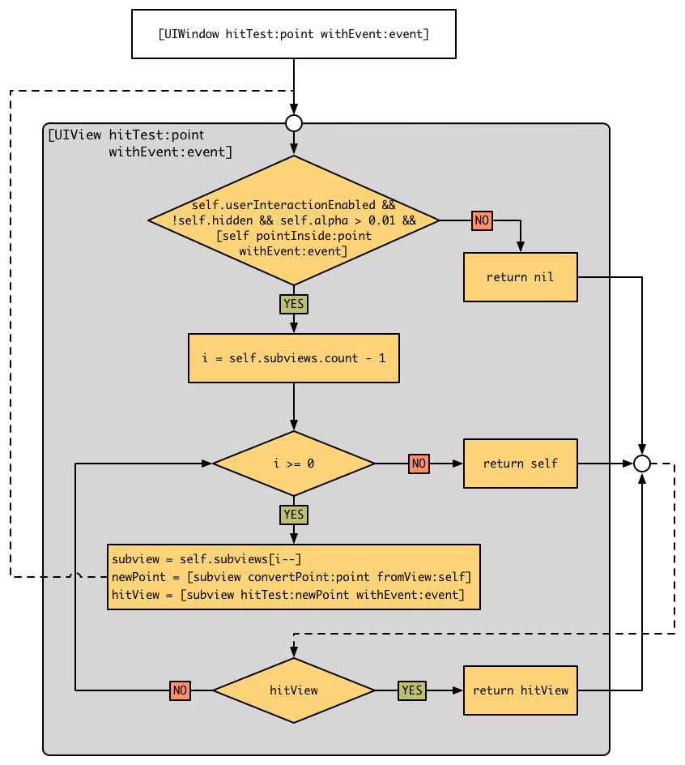

## hitTest 内部实现逻辑？



注意 hitTest 里面是有判断当前的 view 是否支持点击事件，比如 userInteractionEnabled、hidden、alpha 等属性，都会影响一个 view 是否可以相应事件，如果不响应则直接返回 nil。 我们留意到还有一个 pointInside:withEvent: 方法，这个方法跟 hittest:withEvent: 一样都是 UIView 的一个方法，通过他开判断 point 是否在 view 的 frame 范围内。如果这些条件都满足了，那么遍历就可以继续往下走了，代码表现大概如下：

```objective-c
- (UIView *)hitTest:(CGPoint)point withEvent:(UIEvent *)event {
    if (self.hidden || !self.userInteractionEnabled || self.alpha < 0.01 || ![self pointInside:point withEvent:event] || ![self _isAnimatedUserInteractionEnabled]) {
        return nil;
    } else {
        for (UIView *subview in [self.subviews reverseObjectEnumerator]) {
            UIView *hitView = [subview hitTest:[subview convertPoint:point fromView:self] withEvent:event];
            if (hitView) {
                return hitView;
            }
        }
        return self;
    }
}
```


### Reference

https://zhoon.github.io/ios/2015/04/12/ios-event.html
