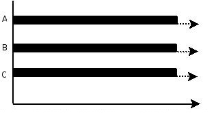

## 什么是并发？什么是并行？并发和并行的区别？

### 什么是并发（concurrency）？

指在同一时刻只能有一条指令执行，但多个进程指令被快速的轮换执行，使得在宏观上具有多个进程同时执行的效果，但在微观上并不是同时执行的，只是把时间分成若干段，使多个进程快速交替的执行。

### 什么是并行（parallel）？

指在同一时刻，有多条指令在多个处理器上同时执行。所以无论从微观还是从宏观来看，二者都是一起执行的。

### 并发和并行的区别？

1. 并行是指两个或者多个事件在同一时刻发生；而并发是指两个或多个事件在同一时间间隔发生。
2. 并行是在不同实体上的多个事件，并发是在同一实体上的多个事件。
3. 并行是在一台处理器上“同时”处理多个任务，并发是在多台处理器上同时处理多个任务。

### Reference

https://www.jianshu.com/p/cbf9588b2afb